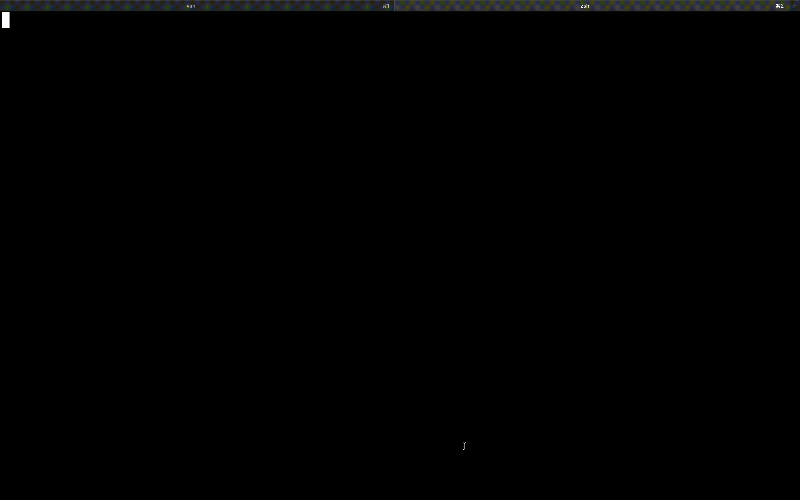

# def

## About it

`def` can play the role of shortcut of docker command🐳

The command will remove annoyance to input full of docker command by taking advantage of [fzf](https://github.com/junegunn/fzf) to select a container from a list of containers.

I hope that You may start a comfortable docker life by using this command :)


## Installation

You can get this command from homebrew

```
$ brew tap RyuseiNomi/tap
$ brew install RyuseiNomi/tap/def
```

## Usage

The command require only one parameter as below.

```
Usage: def [options]

Options:
  exec     Choose container to exec
  stop     Choose container to stop
  status   Show a list of container and status
  list     Show a list of container running
```

## Demo

